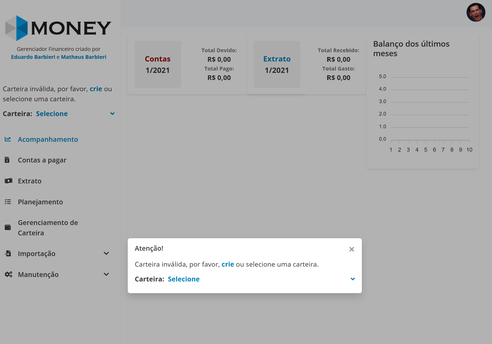

# Money

Sistema de gerenciamento financeiro.
- Separação de dados por carteiras.
- Gerenciamento de contas a pagar.
- Importação de extrato bancário(Itaú).
- Resumo de entradas e saídas mês.
- Gerenciamento de investimentos e metas de investimento.

